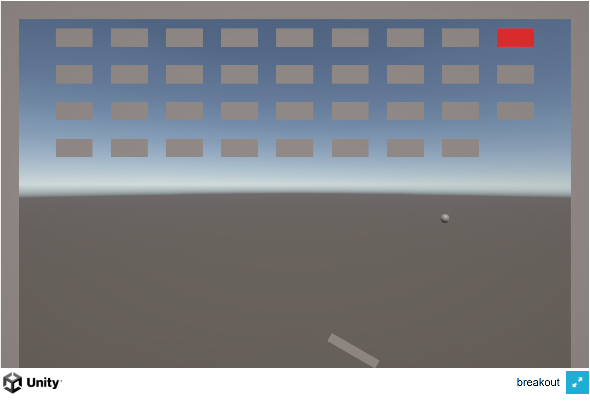
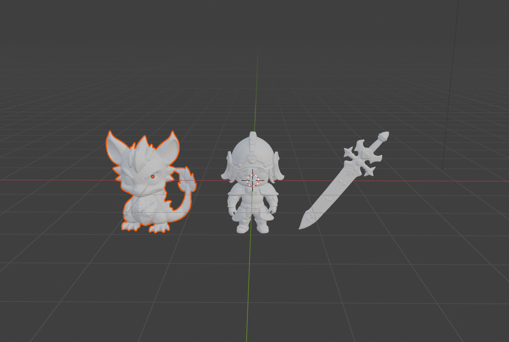
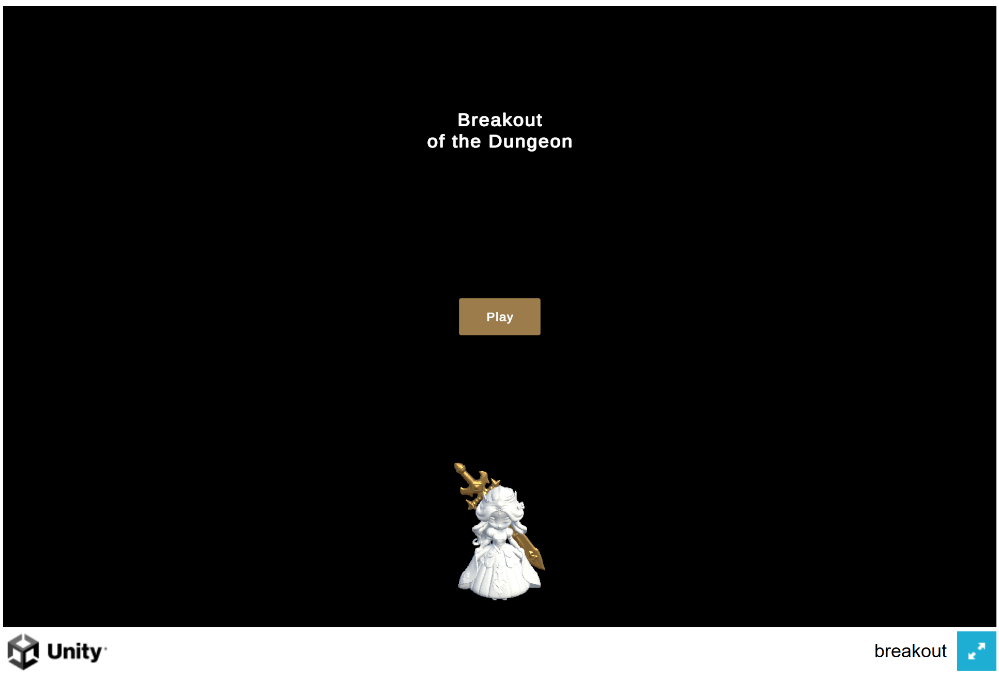
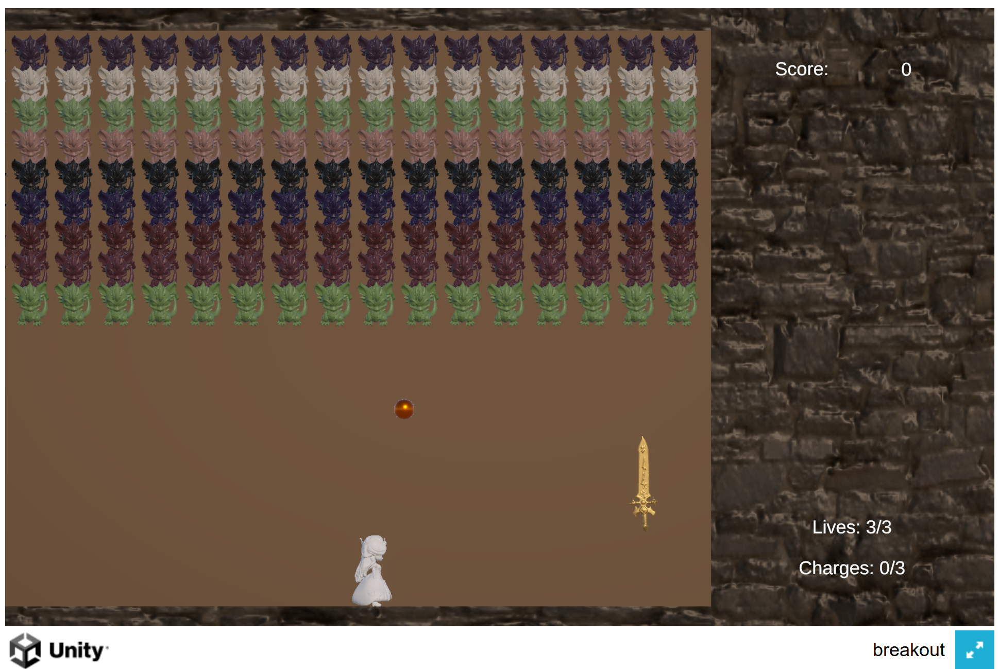

# Innovating with Breakout

## [breakout-1](https://lavanv1107.github.io/game-dev-spring2025/builds/breakout-1/)
In the first version of my breakout prototype, I wanted to start simple. I wondered what single component of the game I could modify to make it slightly more interactive. The one thing that frustrated me about breakout was that I felt like the ball was out of my hands, meaning that the ball chose where to go and I did not. I was in the ball's court while it controlled the flow of the game. So, the one thing I chose to modify to give myself some more sense of control was to be able to tilt the paddle in order to direct where the ball would travel next. 

In this prototype, I learned how to design the basic setup of breakout - the stage, paddle, ball, bricks as well as specific physics (bouncing off surfaces) and game logic (destroy bricks on collision). As for the innovating component of my prototype, I learned how to manipulate a RigidBody GameObject's rotation through control of the mouse wheel. In addition, the most interesting part was learning how to customize the trajectory of the ball's bounce from the paddle through Dr. Treanor's demo.

From the playtesters, I learned that maybe the mouse wheel and keyboard were not the most intuitive controls for the paddle. Some recommended that I consider controlling the paddle's movement with the mouse instead as it gave them the feeling of controlling the paddle almost like a bat and hitting the ball with it.

## [breakout-2](https://lavanv1107.github.io/game-dev-spring2025/builds/breakout-2a/)
In the second version of my breakout prototype, I decided to continue on with the idea of controlling the paddle like a bat in order to hit the ball. BUt this time around, I wanted to get a bit more creative. I personally find a good thematic to be one of the most enjoyable parts of a game. So, while brainstorming with my partner, I came up with the following ideas:
- What if instead of a paddle, the player would instead control a knight wielding a sword
- What if instead of bricks, there would instead be a horde of dragons?
- What if instead of a ball, it would be a fireball which could do damage to the knight?

This thematic spoke to me as it gave you a player character to embody (knight), enemies to fight against (dragons), a modified yet recognizable gameplay (protecting yourself by hitting the fireball) and an end goal which you can resonate with (slay the dragons). 

After nailing this down, I decided something interesting I could do was to venture into the world of Blender and try my hand out at desiging some 3d models for my prototype. With the help of a friend of mine (who is a much more experienced 3D artist), I was able to create some simple models. As I spent a majority of my time working in Blender, I wasn't able to make much progress on the actual gameplay part of my game and was only able to import them as assets in Unity.

## [breakout-3](https://lavanv1107.github.io/game-dev-spring2025/builds/breakout-3/)
In the third version of my breakout prototype, I wanted to go full speed ahead with this medieval, fantasy version of breakout I had devised in my head. But I wanted to make things more challenging, something players can focus on actively other than just bouncing the ball. So now, instead of a knight, our hero will be a cleric. However, the player will not be controlling the cleric. No, the player will actually be the magical sword that she summons to protect herself. Our job now is to not only deflect the fireball against the dragons; it will also be to protect our cleric as she moves back and forth trying to escape danger. If she were to get hit by a fireball, she would become stunned in place for a duration. However, she is not only just scrambling in panic. Every few seconds, she will stand in place (in a vulnerable state) channeling her mana in order to cast spells on the dragons. When hitting dragons inflicted with her magic, we will be gifted with a power-up. I felt this would give the player a reason to be more active in protecting her; as doing so will ensure her survival as well as a benefit for themselves as well.

In this prototype, I was able to learn how to use coroutines in order to control the cleric's movements (back and forth, rotating, standing). In addition, I finally decided to create multiple scenes (start menu, game over, game win) and create UI elements for my prototype.

I received good feedback from my playtesters:
- I had spawned too many dragons in the scene (I thought I had spawned not enough in my previous prototype)
- Speeding up the ball with every dragon killed was just too much and ruined the flow of the game (as well as making the ball go out of bounds)
- The sword should be able to move freely (left, right, up, and down) within a certain perimeter from the dragons as opposed to only left and right (because sometimes the ball would get past the sword into the area underneath it which is undreachable)
- Create different dragons and fireballs for different difficulties (maybe there could be tougher dragons or even multiple fireballs)

## [breakout-final](https://lavanv1107.github.io/game-dev-spring2025/builds/breakout-final/)
In the final version of my breakout prototype, I tried to polish up what I had built so far over this process. I implemented some of what my playtesters had recommended to me. I downsized the number of dragons in my scene, making it less tedious for the player to progress through the level. I fixed the ball's movement by capping its speed and making it so that it only speeds up with every 4 dragons slain. I allowed the sword to be able to move freely in within a certain perimeter away from where I had spawned the dragons in. I fixed one of my power-ups which was supposed to make the sword increase in size for a set duration (it however lasted the whole level).

Overall, I learned alot from this entire journey of implementing my own breakout prototype. Not only the essential skills of game programming and 3D modeling, but also being able to tap into my creativity as a game developer. What do I think as a gamer myself would make this template become even more fun? And it was a fun experience indeed. However, for the next game we design (which I believe is going to be a platformer), I will most likely pivot to Unity 2D project instead.