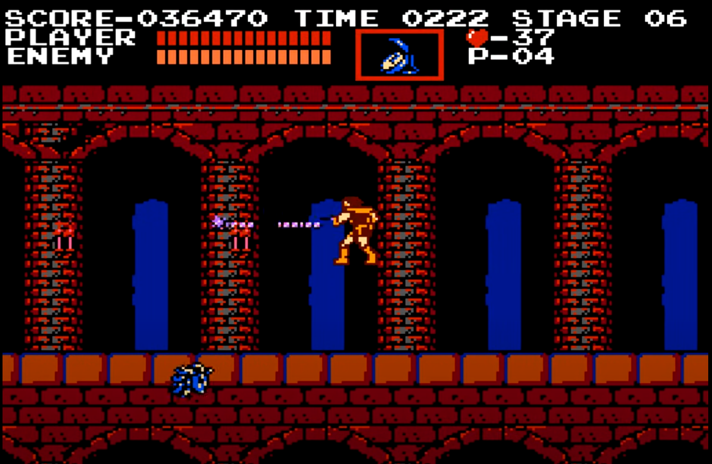
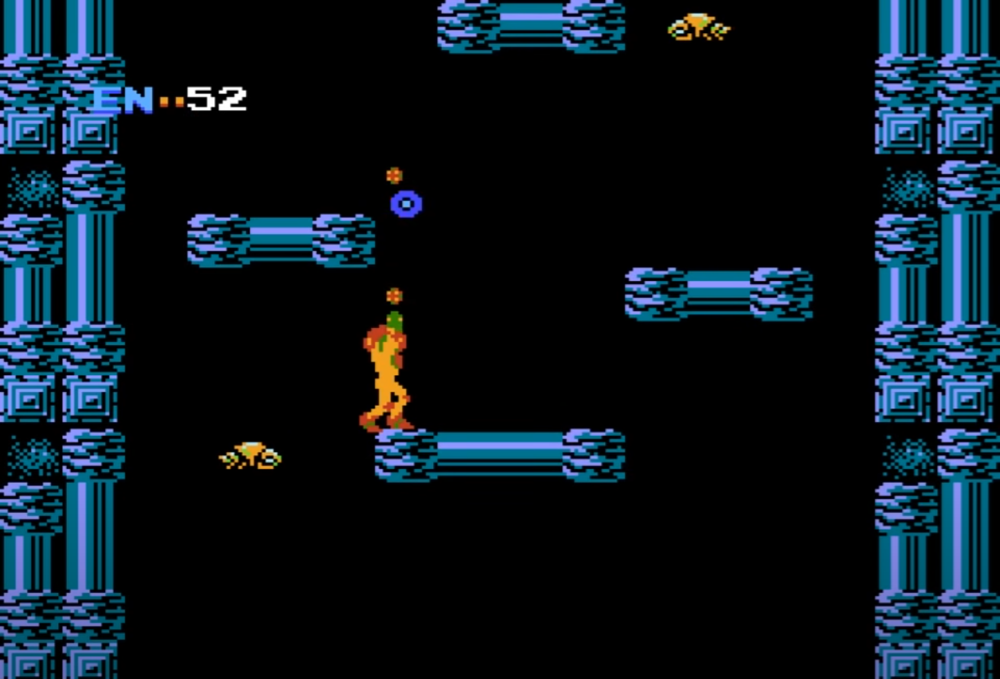
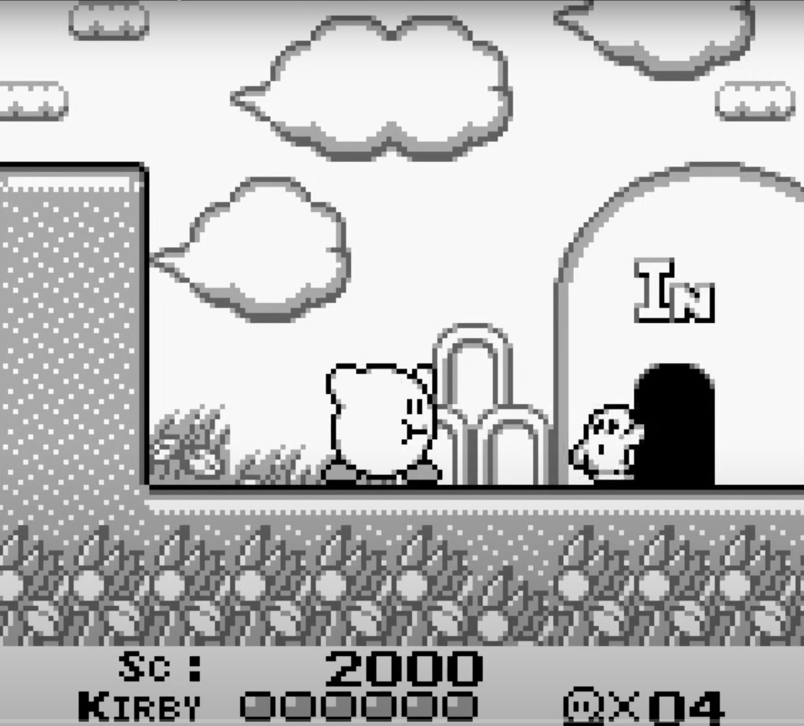

# Platformer Analysis
## Castlevania (1986)
In terms of movement, our player character Simon Belmont is a bit rigid. Although his movement across the ground looks smooth, his stiff body movements in his arms and steps convey a feeling of rigidity to me as a player. 

As for his jump, it gives that same feeling of being smooth but also rigid. It looks to me as if I were to throw maybe a ball and it falls back down into my hand. If you were to jump in place, he would just move straight up. If you were to jump and move mid-air, he would fall towards whichever direction you choose. It looks a bit off to me because it doesn't feel like how a human would jump, but it does however give fast feedback to the player gameplay-wise. A detail I enjoy is that when he jumps, he sort of hunches his body over slightly and bends his legs into his body almost as if in a crouching position. And before his body reaches the ground fully, he extends his legs onto the ground and stretches his body back into his standing position. I thought that was a nice added animation to make his movements more variable than just having his body stand straight-up. However, one thing I noticed that threw me off a bit was that when he attacked while in mid-air, his body actually extends into his standing position. Then for a quick second, it would go back into his jump crouching position, and finally extends his legs into his standing position.

Although Simon Belmont's movements may feel rigid, I think the game's level design is created to work quite well with it. The platforms and obstacles are simplistic in a way that requires fine-grained control of his positioning. This is the same for enemies as well. His rigid movements actually work to our advantage because we can control the exact positioning needed for example, when hitting a flying enemy mid-air with his whip. 

## Metroid (1987)
In Metroid, Samus Aran's movements feel much smoother than that of Simon Belmont in Castlevania. Her arm and leg animation makes you feel like she is truly running through this alien land. However, I do find the animation to be slightly funny. Because to me, whenever she runs, it just looks like she is doing a chicken dance. 

I find Samus' jump to be the most dynamic. Her jumps really make you feel like she is jumping in space. She shoots up and it looks like she's floating somewhat down towards the ground. She can do either a short jump or a high jump. Not only that, but she can even roll when she jumps! It really conveys to the player that she is meant to be this intergalactic bounty-hunter/warrior.

Samus' key movements are definitely taken into account in the level design. There are platforms which require short jumps and those that require higher ones. You might want to roll when jumping to move up faster or hold back in order to move more carefully. A fun addition are the crevices you find in the walls. If you go over to them, Samus will actually crawl down and roll through the hole in order to get past the wall. The funniest thing is that she can just even stay rolling in place.

## Kirby's Dream Land (1992)
In comparison to the other two, Kirby's movement - a combination of both arm and feet animation plus movement across the ground - is very smooth. You can really feel him rushing when you see him move. And when he consumes an enemy; he grows bigger, takes larger steps, and apperas to move a bit more sluggish than usual. Another thing I noticed too is that when you run and stop abruptly, he will slide a little in the direction you are moving as if he was halting to a stop afte running so fast.

Kirby's jump is really the best part. A cute little sound plays whenever he makes a jump. When he jumps, he raises his little arms and feet up making it look like he just took off into the air. He continues this pose as well as he falls down which then makes it look like he's bracing for impact. Kirby can also double jump as well. In order to double jump, he breathes in air and ballons up to go higher. He even tried to flap his arms like a bird for a quick second when he does it. After which, he lets the air out with a small cloud of breath and falls down as usual. But if he falls from really high up, he actually rolls over and face plants when he falls to the ground.

The level design is perfectly curated to Kirby's movements and core ability. Obstacles are created where you would need to utilize his double jump mechanic. Enemies are placed in a way where you need to move around decisively in order to know which enemy to consume and which to spit stars on.

