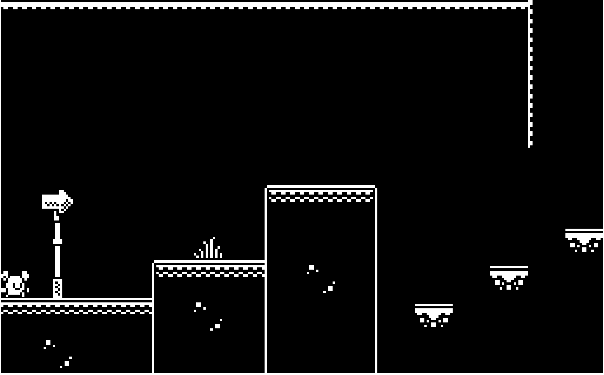

# Platformer Prototype Reflection

## Prototype: 2D Platformer with Advanced Movement Mechanics

### What I Was Experimenting With
So for this prototype, I was playing around with some movement mechanics to give players more options while running and jumping through the levels. I managed to get these working:
- Basic running and jumping
- Double jumping (like when you jump again while already in the air)
- Wall sliding (sticking to walls when you touch them)
- Wall jumping (pushing off walls to jump to other platforms)

I was really trying to make the controls feel good and responsive so players could pull off some precise platforming moves without it feeling frustrating.

### What I Learned
Making this prototype taught me a bunch of stuff about platformer design:

1. **Getting the Physics Just Right is Hard**: Finding that sweet spot for jump height, gravity, and movement speed took a lot of tweaking. If it's too floaty, you can't make precise jumps. Too heavy and it feels sluggish and unresponsive.

2. **Visual Feedback Matters**: I realized how much even small animations help players understand what's happening. Just like how Kirby raises his little arms when jumping, these visual cues make a huge difference in how movement feels.

3. **Timing Windows are Tricky**: For stuff like wall jumps and double jumps, you need timing windows that feel natural. Too strict and players get frustrated, too forgiving and it feels sloppy.

4. **State Management is a Pain**: Keeping track of all the different states (on ground, in air, on wall, etc.) got way more complicated than I expected, especially for those weird edge cases when you're transitioning between states.

### Image of Prototype

### Link to Prototype
[Play the 2D Platformer Prototype](https://github.io/game-dev-spring2025/builds/platformer-1/)

### Future Development
If I were to continue developing this prototype, I would focus on:
- Refining the wall jump mechanics to feel more intuitive
- Adding visual polish to movement transitions, similar to how Kirby has distinct animations for different movement states
- Designing levels specifically to showcase the movement capabilities, as noted in my Kirby analysis: "The level design is perfectly curated to Kirby's movements and core ability. Obstacles are created where you would need to utilize his double jump mechanic."
- Adding more character personality through animations, particularly during state transitions like landing from high falls

